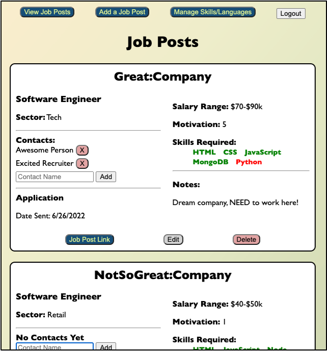
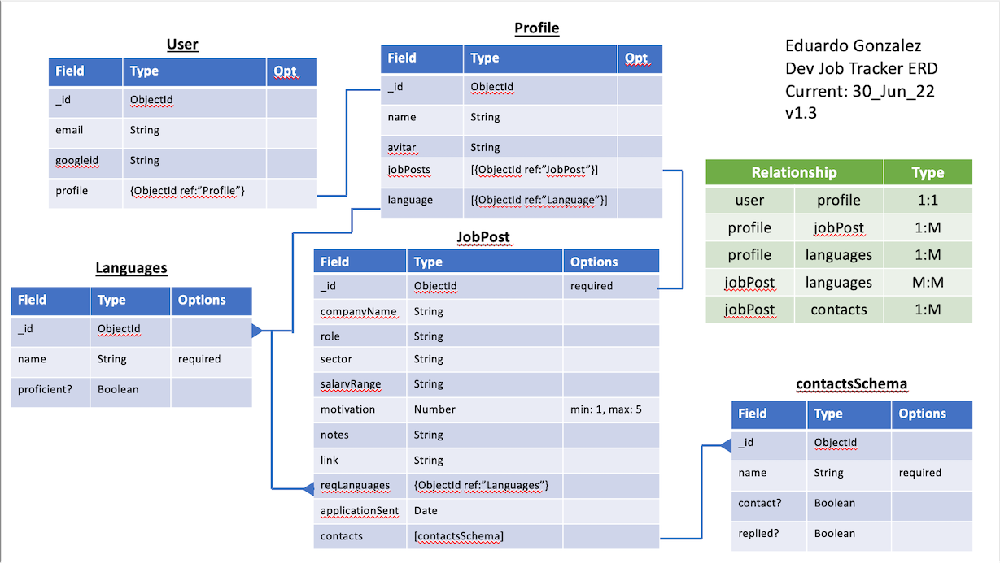

# DEV-JOBS-TRACKER
 
This is an app to keep track of software-development jobs. It demonstrates the use of Node.js, Express, and mongoDB to create a full-stack application. 
 

 
 
## Links to vew my website 
https://devjobstracker.herokuapp.com/ 
 
__Technologies used:__ 
HTML 
CSS 
JavaScript 
Node 
Express 
MongoDB 
Mongoose 
 
 
__Credits:__ 
Bootstrap 
 
 
__Recent changes:__ 
Created App: 30 June 2022 
 
 
__Icebox Items:__ 
Create ability to sort 
Add application tracker 
Ability to make more changes on Job Posts page 
